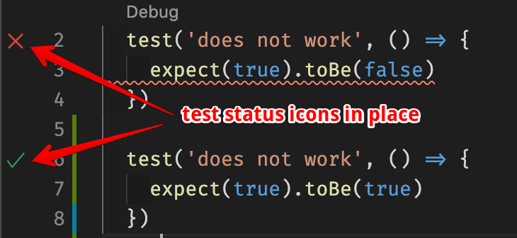
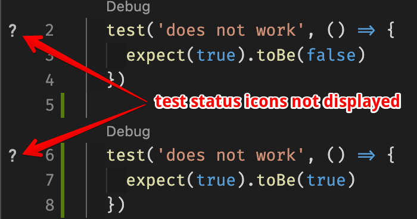

## vscode-jest plugin issue

Test status gutter icons are not shown correctly.
This seems to be caused by the [JUnit reporter](https://www.npmjs.com/package/jest-junit-reporter) configured as:
```
"testResultsProcessor": "./node_modules/jest-junit-reporter"
```

### Expected behavior:


### Actual behavior:

